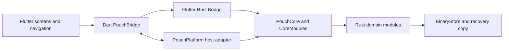

# Pouch architecture

Pouch uses shared Flutter presentation and a Rust application core for Android and the Windows/Linux desktop runners. Version 2 desktop packages passed manual build and runtime validation on Ubuntu 26.04 x64 and Windows 11. Components run locally and communicate through a typed Flutter Rust Bridge. PouchPlatform supplies host services through AndroidPouchPlatform or DesktopPouchPlatform.

## Component ownership

### Flutter

Flutter owns page navigation, forms, dialogs, localization, presentation, and temporary screen state. Feature screens request complete snapshots and reports from Rust; budget rules stay out of the widgets.

PouchBridge is the app-facing Dart boundary for Rust commands and platform services. Generated bridge files adapt typed Rust APIs to Dart. Keep feature logic in the hand-written app and core modules rather than generated adapters.

### Android platform adapter

MainActivity supplies the private app-data directory and saved JSON candidates to the Rust core. It also owns Android file selection for backup and restore, external URL opening, and native PDF printing. Pouch does not depend on a hosted account or backend service.

Platform services stay behind the host adapter. Country defaults, date and calendar rules, income scheduling, budget calculations, report generation, and state validation are implemented in shared Flutter or Rust code without Android-specific assumptions.

### Desktop platform adapter

DesktopPouchPlatform owns the per-user data directory, process storage lock, theme file, bounded backup reads and atomic backup exports. Flutter plugins provide native dialogs, external URL handling and PDF printing. The report screen prepares a localized PDF from the existing Rust report and calendar formatter, with bundled fonts and explicit PDF export. Android retains its HTML print path.

Desktop runners bundle pouch_core.dll on Windows and libpouch_core.so under lib/ on Linux. The hand-written pouch_runtime.dart initializer loads the library by an explicit path relative to the executable; generated bindings and Rust domain APIs are unchanged. Cargokit resolves the Rust manifest from the real plugin directory, including Flutter plugin symlinks.

### Rust core

PouchCore exposes the application operations used by Flutter. CoreModules owns the validated state, revision, storage boundary, and single-step undo state. It constructs focused feature services with explicit dependencies.

Domain modules own money, dates, calendar conversion, income, budget plans, purchases, expenses, savings goals, reports, and preferences. Money is represented as integer minor units. Stored dates use canonical Gregorian day values; the selected calendar controls display and date entry.

## Command and persistence flow

For a write, Flutter calls a typed Rust command. Rust validates the request, prepares and validates the next complete state, writes it, then publishes the new state and revision. If validation or storage fails, the active state remains unchanged.

BinaryStore stores the app state in a versioned binary envelope with a format marker, payload length, and checksum. It writes a temporary file in the private app-data directory and atomically replaces the primary file after the new data has been validated. A recovery copy is kept so startup can use the last known good state if the primary file cannot be read.

At startup, Rust first checks the binary store. If no valid state is present, it tries the ordered JSON candidates supplied by the platform adapter (Android legacy records; an empty list on desktop), validates a supported document, saves the resulting state in the binary store, and reports that records were imported. Invalid input is not written over the current state. JSON backups remain portable and are validated before restore.

## Backup and platform boundaries

Rust owns JSON backup parsing, schema validation, and conversion to app state. Flutter owns the backup screens and confirmation flow. The selected platform adapter supplies the system file picker and printing services. Reports are calculated in Rust; Flutter formats Android HTML or desktop PDF without adding accounting rules.

Preferences own the selected country, language, currency, calendar, and week start. Country applies regional defaults for currency, calendar, and week start. Users can still adjust the calendar and week start, and the existing Persian-language behavior continues to select the Jalali calendar when Persian is first selected. English and Persian strings live in Flutter localization files. Language controls text direction; calendar selection controls date interpretation.

Expected income is stored separately from recorded income. It appears in the income calendar and can be edited, removed, or marked received. Budget, savings, and reports use recorded income only, so forecasts do not fund spending before the user confirms receipt.

Budget plans expose monthly savings and essential expenses. The stored fallback salary, base daily budget, payday, and daily override fields remain in backups for compatibility, but no longer fund or limit recommendations. Received income anchors funded periods; unfunded dates use the selected calendar without inventing income.

The savings module owns the shared allocation. It reserves the greater of the configured minimum and the amount needed by cumulative goals in target date order. Goal amounts are never also counted as ordinary planned expenses. Funded progress is capped by received income after essential expenses, purchases, and pending expenses; goal purchases consume the shared allocation. Allocations are calculated from history rather than stored as a separate savings ledger, so changes to goals can recalculate past allocations. The goals module owns completion estimates and marginal daily spending reductions. Completion assumes similar future income and discretionary spending, and is unavailable when funding cannot support savings.

Planned Expenses presents current allocated amounts; the dedicated Financial Forecast page owns completion estimates and recommendation previews. Today keeps purchase entry and opens editing history in a dialog on demand. The goal forecast bridge includes completion_days and daily_reduction; regenerate its typed adapters after API changes before validation.

## Source map

### Financial forecast preview

The dedicated Financial Forecast page reads pending expenses and savings goals created in Planned Expenses. The Rust forecast module owns calculations; Flutter owns a shared target selector, the recommendation income-basis selector and presentation. The read-only API never changes state, persistence, revision, or undo history.

Monthly values use the current income-cycle length. Income comes from the currently funded recorded-income period. The recorded preview uses spending per elapsed day, or today's funded budget recommendation when there is no spending history. A zero allowance displays a warning. Recommendations either preview 10% lower everyday spending with recorded income or hold current spending and calculate required income. Essential costs remain fixed, and allocations are computed from the recorded plan before hypothetical changes. Expected income is never treated as available money.

Goal allocations reuse the savings balance. Ordinary expenses draw from current-cycle disposable money, capped by the existing funded budget and reduced by spending, savings allocations and the remaining everyday allowance. Each pool is allocated once in target-date and ID order. Deadline rates use cumulative remaining amounts within each pool; required income covers both pools, essential costs, the everyday allowance, and the configured savings minimum. An unfunded due or overdue commitment has no finite deadline income requirement.

Completion projects the remaining cumulative amount at the income left after essential costs, everyday spending, and the other pool's deadline commitments. It assumes similar future received income and unchanged costs, with earlier targets funded first. It is unavailable without positive capacity or when the projected date is outside the supported date range. A fully allocated target completes today with zero days remaining. Hypothetical income and spending never change today's funded budget.

The completion date is calculated in Rust as the forecast date plus remaining days. Flutter converts it through the existing calendar API and displays day/month/year (DD/MM/YYYY) using the selected calendar and localized digits, beside the number of days remaining. Both English and Persian are supported.

Before building, regenerate the typed bridge for the new financial_forecast method. See docs/FINANCIAL_FORECAST.md for manual validation.

- flutter/lib/features contains the Preferences, Budget Plan, Today, Planned Expenses, Financial Forecast, Reports, and About screens.
- flutter/lib/core contains the Dart bridge wrapper, models, formatters, theme, and localization helpers.
- flutter/android contains the Android application shell.
- flutter/windows and flutter/linux contain desktop runners.
- flutter/lib/core/pouch_platform.dart owns the OS service boundary.
- flutter/lib/features/reports/report_pdf.dart and desktop_report_dialog.dart own desktop PDF presentation.
- docs/DESKTOP.md documents manual builds and acceptance.
- rust/src/api contains the typed application API exposed through the bridge.
- rust/src/core contains state ownership and command coordination.
- rust/src/budget, rust/src/income, rust/src/purchases, rust/src/expenses, rust/src/savings, rust/src/goals, rust/src/reports, and rust/src/preferences contain domain operations.
- rust/src/storage and rust/src/backup contain persistent storage and portable backup handling.

### Economic Profiles and Standard Forecast

Financial Forecast owns a shared target selection and three always-visible sections: recorded data, Pouch Recommendation and Standard Forecast. Income basis switches only the recommendation between recorded and required income. The typed bridge carries the basis, essential/configured amounts, extra days and faster-day comparisons, requiring regeneration before validation. Flutter shares responsive metric grids across personal and country results. Forecast previews never mutate financial state.

The `economics` Rust module retrieves and validates public economic data, caches it independently from financial storage, and calculates a read-only Standard Forecast from the selected target's remaining allocation. Canada retains its provider mapping; international adapters cover the other five OECD countries and Iran. Iran is explicitly an urban household scenario rather than an individual salary estimate. The existing JSON API carries converted goal amounts, deadline saving/income requirements and benchmark completion estimates. Flutter presents compact metrics, expandable source details, refresh status and optional customization. Downloading runs outside the opaque financial session so the core is not held across network calls. Personal financial data are never sent to providers. Source mappings and manual acceptance checks are documented in `docs/ECONOMIC_PROFILES.md`.

Explicit custom assumptions use existing AppState persistence and JSON backups. Binary schema 3 includes an explicit schema 2 migration; JSON backup 6 accepts older backups. Cached statistics use a separate versioned JSON file with atomic recovery and never clear financial undo or overwrite custom assumptions. Country profiles use ISO codes independently of Settings' initial country enum. Source mappings, formulas, limitations and required manual validation are documented in [Economic Profiles](docs/ECONOMIC_PROFILES.md). The Version 2 application builds and automated validation passed; see [release verification](docs/RELEASE_V2.md).

SCI retrieval uses a separate TLS client in `economics::sci_tls`. A reviewed public intermediate is supplied only to the normal verifier's chain-building input for the two official SCI hosts; root trust, hostname/date checks and handshake signatures are unchanged. Other providers keep their existing client. Iran failures are categorized by request/TLS, HTTP, body, parsing, validation and cache stage. Runtime SCI HTML parsing remains temporary; a reviewed versioned JSON dataset is planned separately.
