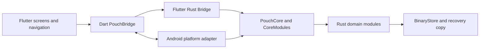

# Pouch architecture

Pouch is an Android app with Flutter presentation and a Rust application core. The components run on the device and communicate through a typed Flutter Rust Bridge.

## Component ownership

### Flutter

Flutter owns page navigation, forms, dialogs, localization, presentation, and temporary screen state. Feature screens request complete snapshots and reports from Rust; budget rules stay out of the widgets.

PouchBridge is the app-facing Dart boundary for Rust commands and Android platform calls. Generated bridge files adapt typed Rust APIs to Dart. Keep feature logic in the hand-written app and core modules rather than generated adapters.

### Android platform adapter

MainActivity supplies the private app-data directory and saved JSON candidates to the Rust core. It also owns Android file selection for backup and restore, external URL opening, and native PDF printing. Pouch does not depend on a hosted account or backend service.

### Rust core

PouchCore exposes the application operations used by Flutter. CoreModules owns the validated state, revision, storage boundary, and single-step undo state. It constructs focused feature services with explicit dependencies.

Domain modules own money, dates, calendar conversion, income, budget plans, purchases, expenses, savings goals, reports, and preferences. Money is represented as integer minor units. Stored dates use canonical Gregorian day values; the selected calendar controls display and date entry.

## Command and persistence flow

For a write, Flutter calls a typed Rust command. Rust validates the request, prepares and validates the next complete state, writes it, then publishes the new state and revision. If validation or storage fails, the active state remains unchanged.

BinaryStore stores the app state in a versioned binary envelope with a format marker, payload length, and checksum. It writes a temporary file in the private app-data directory and atomically replaces the primary file after the new data has been validated. A recovery copy is kept so startup can use the last known good state if the primary file cannot be read.

At startup, Rust first checks the binary store. If no valid state is present, it tries the ordered JSON candidates supplied by Android, validates a supported document, saves the resulting state in the binary store, and reports that records were imported. Invalid input is not written over the current state. JSON backups remain portable and are validated before restore.

## Backup and platform boundaries

Rust owns JSON backup parsing, schema validation, and conversion to app state. Flutter owns the backup screens and confirmation flow. Android owns the system file picker and print window. Reports are calculated in Rust and rendered for printing by the platform adapter.

Preferences own the selected language, currency, calendar, and week start. English and Persian strings live in Flutter localization files. Language controls text direction; calendar selection controls date interpretation.

## Source map

- flutter/lib/features contains the Preferences, Budget Plan, Today, Planned Expenses, Reports, and About screens.
- flutter/lib/core contains the Dart bridge wrapper, models, formatters, theme, and localization helpers.
- flutter/android contains the Android application shell and platform adapter.
- rust/src/api contains the typed application API exposed through the bridge.
- rust/src/core contains state ownership and command coordination.
- rust/src/budget, rust/src/income, rust/src/purchases, rust/src/expenses, rust/src/savings, rust/src/goals, rust/src/reports, and rust/src/preferences contain domain operations.
- rust/src/storage and rust/src/backup contain persistent storage and portable backup handling.
