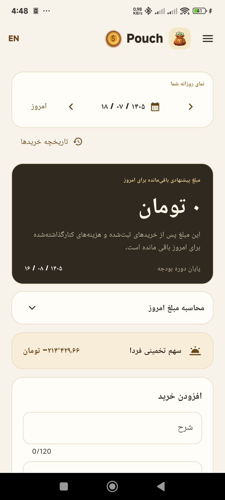
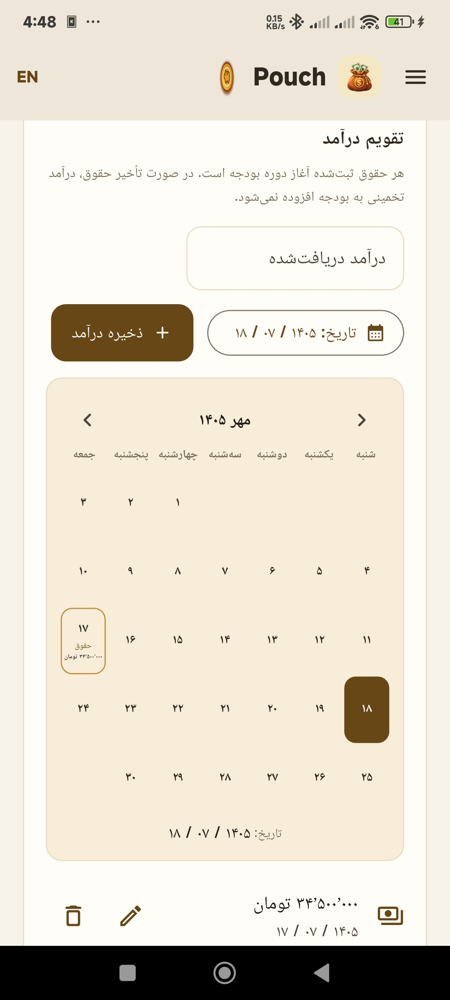
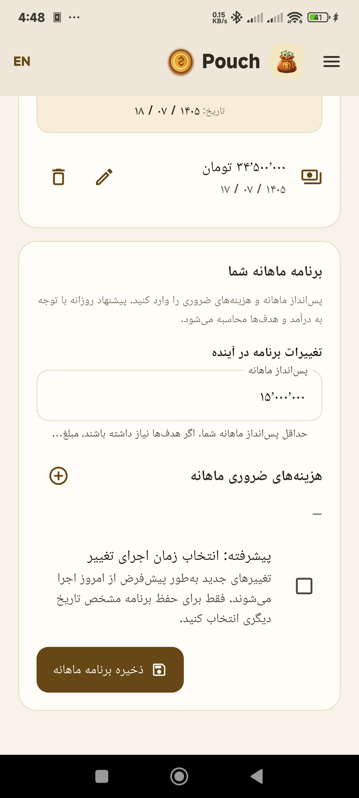
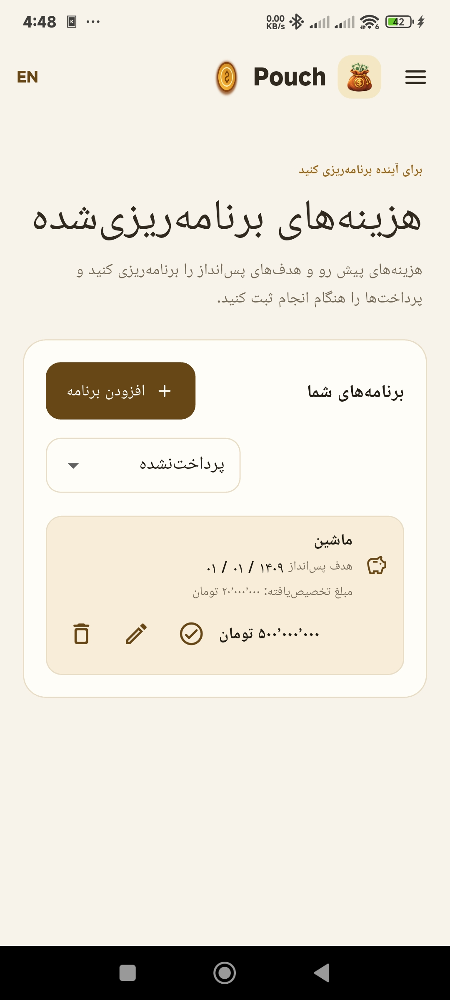
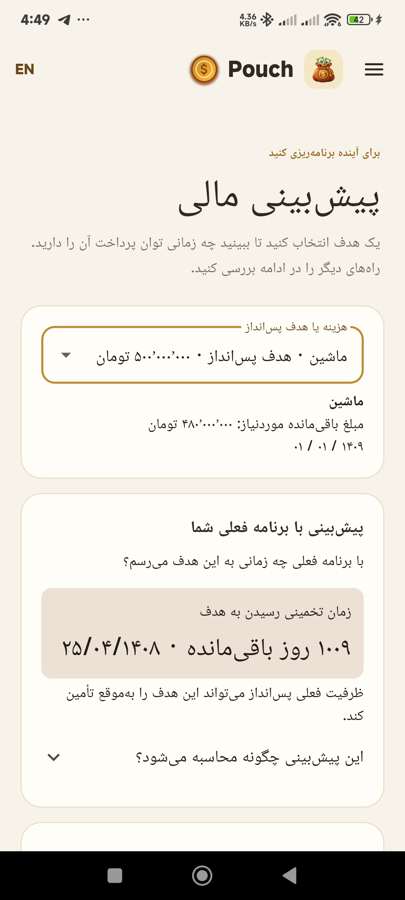
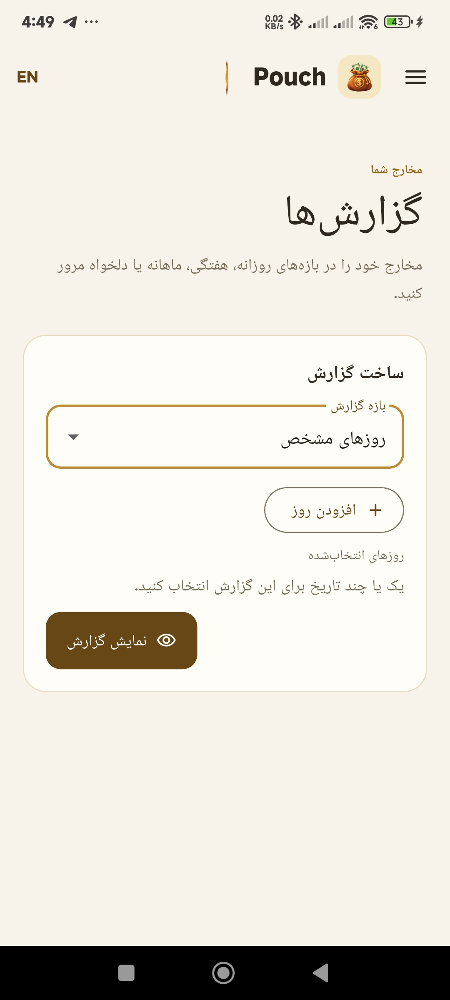
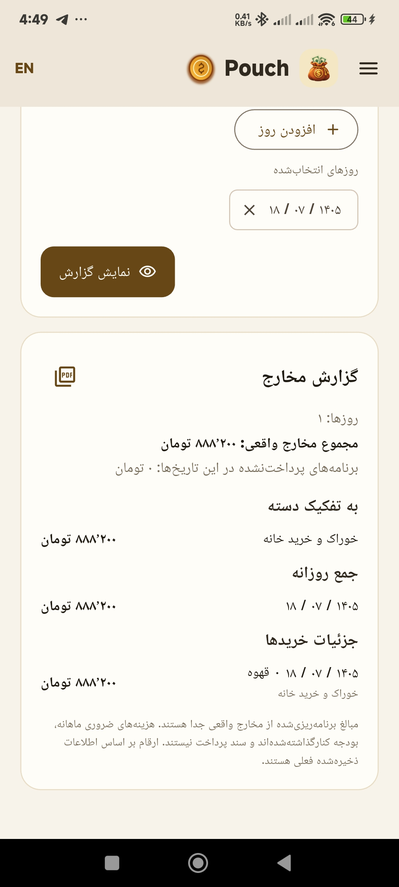
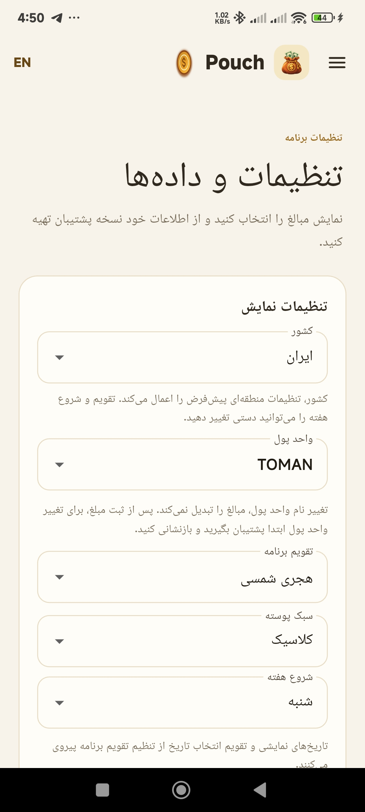
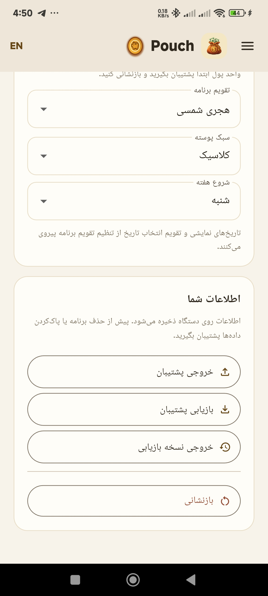

  

# Pouch

Pouch is an offline spending planner with a Flutter interface and a Rust core. Version 2 supports Android, Windows x64, and Linux x64. It helps you plan a budget, record income and purchases, reserve money for upcoming expenses, track savings goals, and prepare reports.

The project is maintained by [AlighasemiQWxp](https://github.com/AlighasemiQWxp).

## App walkthrough

These Android screenshots show Pouch in Persian. Follow the guide below to record income, plan spending, and review your progress. Click any screenshot to view it at full size.

### 1. Today: check your daily spending

  

Today shows how much the plan recommends you can still spend on the selected day, after recorded purchases and reserved expenses. Use the arrows or calendar to change the date, expand the calculation to understand the amount, and record purchases in the form below. Open Purchase history to review or edit earlier entries.

### 2. Budget Plan: record received income

  

Enter the amount you received, select its date, and save the income. The calendar shows recorded income, and the pencil and trash icons let you edit or remove an entry. Received income funds your budget; expected income stays separate until it is marked received.

### 3. Budget Plan: set your monthly plan

  

Set your minimum monthly savings and add essential monthly expenses, then save the plan. Pouch uses your income, expenses, and goals to calculate daily spending recommendations. Changes normally apply from today; the advanced date option lets you choose when a change takes effect.

### 4. Planned expenses: organize upcoming costs and goals

  

Choose Add plan to create an upcoming expense or savings goal with an amount and target date. The list shows each target and its allocated funds. Use the filter to review payment status, the pencil to edit, or the checkmark to record payment when it happens. Allocated savings are part of the budget calculation, not a transfer to a separate bank account.

### 5. Financial Forecast: see when a goal could be funded

  

Select an expense or savings goal to see the remaining amount, estimated completion date, and whether your current plan can meet its deadline. Expand How this is calculated to review the assumptions. Further down, explore changes to spending or income and compare country scenarios. Forecasts are estimates based on the plan, not guaranteed outcomes.

### 6. Reports: choose what to review

  

Choose a report period: individual days, a date range, a week, or a month. For individual days, use Add day to select one or more dates, then choose Show report. Week and month selection follow the calendar and week-start preferences in Settings.

### 7. Reports: understand your spending

  

The report summarizes actual spending, category totals, daily totals, and individual purchases for your selection. Unpaid planned expenses are shown separately from actual spending. Use the PDF button to prepare a printable report.

### 8. Settings: choose regional and display preferences

  

Choose your country, currency label, calendar, theme, and first day of the week. Country selection supplies regional defaults, while the calendar and week start can be adjusted manually. Changing the currency label does not convert saved amounts. The screenshots show the Persian interface with the Jalali calendar; English is also available.

### 9. Settings: back up and restore your data

  

Use Export backup to save a copy of your local data and Restore backup to load a saved copy. Export recovery copy provides the saved recovery data when available. Keep a backup before uninstalling the app or clearing its data; Reset clears the app data.

## Features

- English and Persian interfaces, with right-to-left Persian layouts and Gregorian or Jalali calendars
- Country-based currency, calendar, and week-start defaults, with manual calendar and week-start choices
- Recorded income and future expected income, kept separate until it is marked received
- Backdated income and purchases in Budget Plan and Today, including dates before first use; earlier records extend the first budget plan and carry-forward history
- Income calendar and a simple monthly plan for savings and essential expenses
- Financial Forecast with a shared target, clear completion/deadline status, expandable improvements and country comparison (see [Financial Forecast](docs/FINANCIAL_FORECAST.md))
- Standard Forecast with automatic data retrieval for all seven named countries, deadline saving and income requirements, currency conversion, offline caching and optional local assumptions (see [Economic Profiles](docs/ECONOMIC_PROFILES.md))
- Daily spending recommendations with carry-forward balances
- Planned expenses that reserve money until paid
- Automatic savings allocations shared across goals, with funded progress, daily spending adjustments, and completion estimates
- Purchase history available on demand, with editing and undo for recent deletions
- Reports for selected days, date ranges, weeks, and months, with PDF printing on Android
- Local JSON backup and restore, with recovery copies for saved data

Pouch keeps budgeting data on the device. Its recommendations are calculations from recorded income and expenses, not a bank balance or a promise of future income.

Budget Plan uses the calendar chosen in Settings. Received income funds daily recommendations; manual salary, base allowance, payday, and daily overrides are no longer used. Existing backup fields remain readable for compatibility. Monthly savings is a minimum: goals can increase the shared allocation, while essential expenses and recorded spending reduce available funds. Goal progress describes funds allocated by the model, not money transferred to a separate account. Goal completion estimates assume similar future received income and spending; expected income never funds current progress. Target dates determine goal priority. Changing a goal recalculates allocations from the recorded history.

Today shows the spending recommendation, expense entry, and relevant planned expenses. Purchase history opens only when requested, without search or category filters.

Reports calendars highlight the selected date range, individual days, full week, or full month. Weekly selection follows the chosen week start, and monthly selection follows the Gregorian or Jalali calendar chosen in Settings. Selecting a date updates the corresponding range endpoint, adds an individual day, or chooses the week or month to report.

## Project structure

- flutter contains the application interface, navigation, localization, and platform integration.
- rust contains the budget domain, calculations, backup validation, and persistent storage.
- ARCHITECTURE.md describes module responsibilities and data flow.
- SECURITY.md explains data handling and vulnerability reporting.

## Build and run

Install Flutter, the Android SDK, and the Android NDK version pinned by the Flutter Gradle configuration. From the flutter directory, run:

    flutter pub get
    flutter run

The Android release build uses the application version shown in the About page. Configure a private Android signing key before distributing a release build; keep signing files and passwords outside this repository.

If you change the Rust API, regenerate the Flutter bridge from the flutter directory with flutter_rust_bridge_codegen generate, then build and verify the app manually on an Android device.

## Desktop support

Windows x64 and Linux x64 runners, platform services, and manual packaging scripts are prepared. See [desktop build and acceptance instructions](docs/DESKTOP.md). Version 2 packages have passed manual build and runtime validation on Ubuntu 26.04 x64, Android, and Windows 11. Windows is an unsigned portable release. Ubuntu 24.04 compatibility of the published Linux package has not been verified. The Linux workflow runs on every push to main and on pull requests, and can also be started manually. It checks the Flutter frontend and Rust core, builds the Linux application, and uploads an Actions artifact rather than a release. Results appear in GitHub Actions and commit or pull-request checks.

## Version 2

Version 2.0.0 (Android build 4) packages are validated for Android, Linux x64, and Windows x64. See the [changelog](CHANGELOG.md), [release verification record](docs/RELEASE_V2.md), and [GitHub release](https://github.com/AlighasemiQWxp/Pouch/releases/tag/v2.0.0).

## Release signing and validation

Keep the release keystore and its properties file outside this repository. Back them up securely so future versions can use the same key.

Create the private directory first, then generate a keystore with the JDK keytool command. Enter passwords interactively:

    keytool -genkeypair -v -keystore "C:\Private\Pouch\pouch-release.jks" -keyalg RSA -keysize 2048 -validity 10000 -alias pouch

Create `C:/Private/Pouch/signing.properties` with these fields, replacing the placeholders privately. Use forward slashes for the absolute keystore path:

    storeFile=C:/Private/Pouch/pouch-release.jks
    storePassword=YOUR_PRIVATE_STORE_PASSWORD
    keyAlias=pouch
    keyPassword=YOUR_PRIVATE_KEY_PASSWORD

In PowerShell, set the properties file location and run validation from the repository root:

    $env:POUCH_SIGNING_PROPERTIES = "C:\Private\Pouch\signing.properties"
    .\validate-and-build.ps1

The script checks Rust formatting, Clippy and tests, Flutter analysis and available tests, then builds the signed APK at `flutter/build/app/outputs/flutter-apk/app-release.apk`. Debug builds do not require signing credentials. Release builds fail when credentials are missing and never fall back to the debug key.

Verify the new APK on an Android device before publishing. An installation signed with the debug key cannot be updated by this release key. Export a backup before uninstalling that installation, then restore it in the signed app.

## License

Pouch is covered by the Pouch Source-Available License 1.0 in LICENSE. Third-party dependencies remain under their own licenses.
